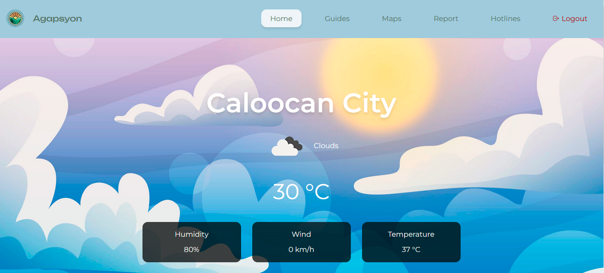

# AgapSyon-WebApp



## About the Project

"AgapSyon: Paghanda at Pag-aksyon sa mga Sakuna”, is a web application that addresses the Philippines' lack of resources in managing disaster readiness and disaster response. Due to the country's vulnerability to natural calamities, including floods, typhoons, earthquakes, fire, volcanic eruptions, and landslides.

AgapSyon aims to provide daily weather updates, guidelines for disaster preparedness, maps of evacuation centers, emergency hotlines, and the Report feature.

This application is built using Tailwind CSS, React JS, and Firebase. 

## Getting Started

To get a local copy up and running, follow these steps. 

### Prerequisites

Before you begin, ensure you have installed the latest version of:

- Node.js and npm
- Git

### Installation

1. Clone the repository:
   ```bash
   git clone https://github.com/prince-bojji/AgapSyon-WebApp.git

2. Navigate to the project directory:
   ```bash
    cd agapsyon
3. Install the project dependencies:
   ```bash
    npm install
5. Start the development server:
   ```bash
    npm start

Now you should be able to see the project running at localhost:3000. 

## Contributing

We welcome contributions from everyone. If you're interested in improving the project, please follow the steps below:

1. Fork the Project
2. Create your Feature Branch (`git checkout -b feature/YourFeature`)
3. Commit your Changes (`git commit -m 'Add some feature'`)
4. Push to the Branch (`git push origin feature/YourFeature`)
5. Open a Pull Request


